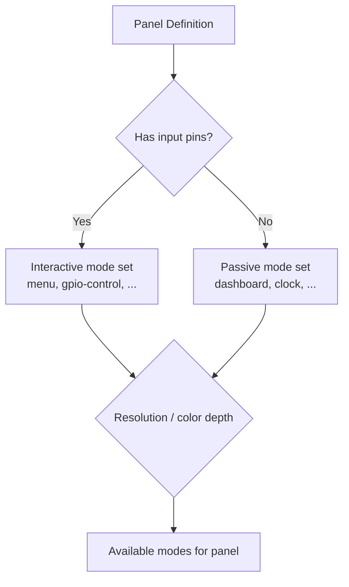
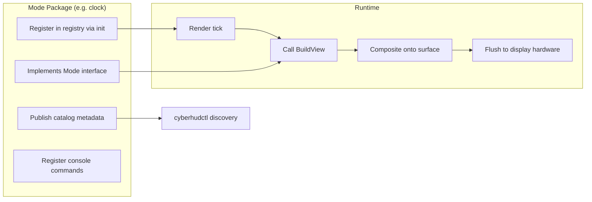

# Display Modes

Display modes control what content is rendered on your attached panel. Each mode is a self-contained module that produces a view — title, items, sprites — which the UI loop renders to the display surface. CyberHUD ships with 27 user-facing display modes covering everything from clocks and system dashboards to serial monitors, interactive menus, and user-driven gauges.

## Mode Summary

| Mode ID | Title | Summary |
|---------|-------|---------|
| [attract_bokeh](attract_bokeh.md) | Bokeh | Ambient floating bokeh light orbs with configurable size and saturation |
| [attract_geometric](attract_geometric.md) | Geometric | Clusters of semi-transparent rotating rectangles with sinusoidal fade and glow effects |
| [attract_hacking](attract_hacking.md) | Hacking | Rapid-fire command output simulation with scrolling terminal effect |
| [attract_matrix](attract_matrix.md) | Attract Matrix | Cascading character rain effect inspired by the Matrix |
| [attract_particles](attract_particles.md) | Particles | Drifting particle field with glow and drift effects |
| [attract_plasma](attract_plasma.md) | Plasma | Animated plasma color cycling with blob scaling |
| [attract_shapes](attract_shapes.md) | Shapes | Pulsing geometric shapes with configurable complexity |
| [attract_starfield](attract_starfield.md) | Starfield | Multi-layer parallax starfield animation |
| [attract_waveform](attract_waveform.md) | Waveform | Flowing waveform traces with persistence and direction control |
| [clock](clock.md) | Clock | Displays the current time with configurable style |
| [cycle](cycle.md) | Cycle | Auto-cycles through configured display modes on one or more regions at a configurable interval |
| [dashboard](dashboard.md) | Dashboard | Consolidated status overview of STEMMA devices, GPIO, and system health |
| [gauges](gauges.md) | Gauges | User-supplied progress bars, rings, and dials for personal dashboards |
| [gpio](gpio.md) | GPIO | Read-only view of GPIO pin states with color coding |
| [gpio_control](gpio_control.md) | GPIO Control | Interactive GPIO pin toggling via buttons/joystick |
| [image](image.md) | Image | Displays a static image on the panel |
| [menu](menu.md) | Menu | Interactive on-display navigation menu |
| [pager](pager.md) | Pager | Tails a data source and presents text with smooth scrolling or page transitions |
| [serial](serial.md) | Serial Monitor | Live serial communication monitor with scrolling text |
| [stemma](stemma.md) | STEMMA | Lists detected I2C STEMMA QT/QWIIC devices |
| [system](system.md) | System | Host information including hostname, uptime, CPU, memory, network |
| [systemd](systemd.md) | Systemd Boot | Boot progress diagnostics shown during daemon startup |
| [thermal](thermal.md) | Thermal | Temperature monitoring with thermal zone visualization |
| [ticker](ticker.md) | Ticker | Scrolling text feed from external data sources |
| [usb](usb.md) | USB Bench | USB device identification with hot-plug detection |
| [wifi](wifi.md) | WiFi | Wireless network status, signal strength, and connection details |
| [zmq](zmq.md) | ZMQ | ZeroMQ message bus display for inter-process communication |

## Listing Available Modes

Not every mode is available on every panel. To see which modes are enabled for your active panel:

```sh
cyberhudctl display modes
```

For detailed mode metadata including configuration options:

```sh
cyberhudctl help modes
```

!!! tip
    The output of `cyberhudctl display modes` reflects your panel's actual capabilities — only modes compatible with the panel's input controls and display resolution are listed.

## Switching Modes

Switch the active display mode using either syntax:

```sh
# Switch to clock mode on the main region
cyberhudctl display set 0 clock
```

You can also cycle through modes:

```sh
cyberhudctl display next main.0
cyberhudctl display prev main.0
```

Regions are addressed using `<surface>.<index>` notation (e.g., `main.0`, `left-aux.0`) or bare integer coordinator indices (`0`, `1`, `2`). Run `cyberhudctl display regions` to see configured regions.

!!! note
    If you are new to `cyberhudctl`, see the [Getting Started CLI page](../getting-started/cli.md) for an introduction to command syntax and connection setup.

## Mode Availability



Not all modes are available on every panel. The available modes depend on:

- **Input controls** — Interactive modes like `menu` and `gpio-control` require buttons or a joystick. Panels without input run in passive mode with `dashboard` as the default.
- **Display capabilities** — Some modes produce content optimized for specific resolutions or color depths.
- **Panel configuration** — Each panel defines its own ordered list of supported modes.

Use `cyberhudctl display modes` to see which modes are enabled for your active panel.

## How Modes Work



Each display mode is a Go package under `display/modes/` that:

1. **Implements the `Mode` interface** — provides `BuildView()` and lifecycle methods
2. **Registers in the central mode registry** at import time via an `init()` function
3. **Publishes catalog metadata** (title, summary, options) for CLI discoverability
4. **Optionally registers console commands** for mode-specific interaction (e.g. `ticker set`, `image set`)

The daemon's UI loop queries the active mode on each render tick, calls `BuildView()` to get the current state (title, items, colors, sprites), and composites the result onto the display surface.

For more on how this fits into the overall system, see the [Architecture](../reference/architecture.md) page.
