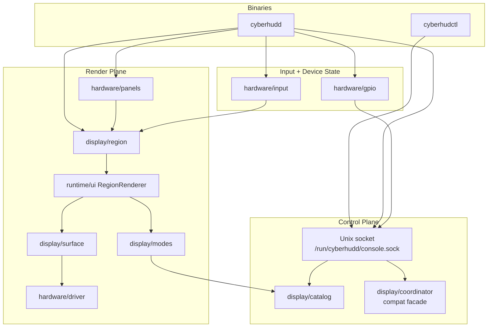
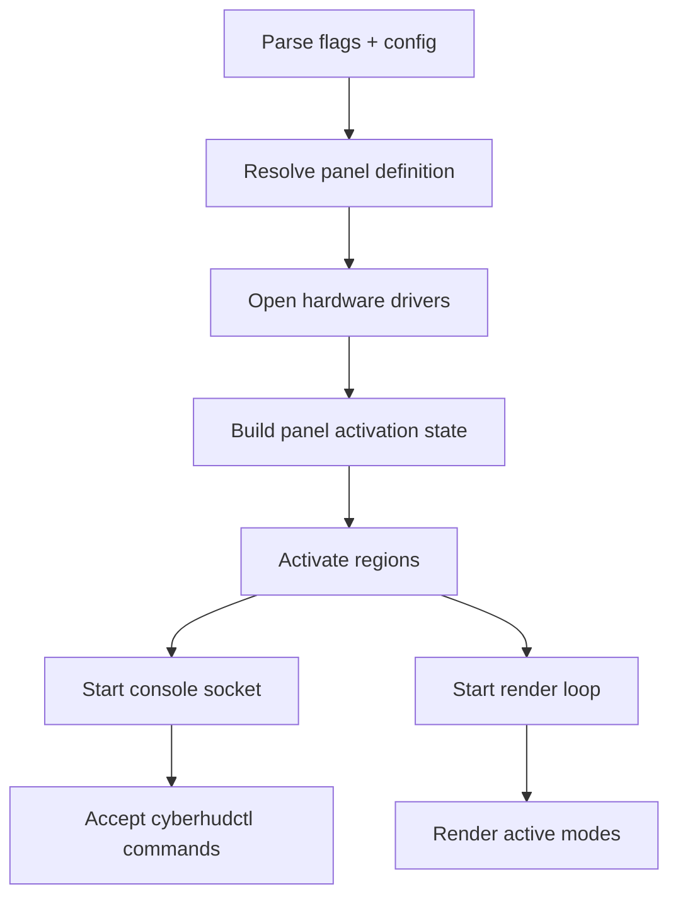

# Architecture

cyberhud is split into a small set of boundaries: binaries, control plane, render plane, and hardware. The old page mixed those layers together and then drew a tiny mode graph that implied the internals revolved around a few display modes. They don’t. Modes are just one pluggable part of a larger render pipeline.

## Component Map

## Binaries

`cmd/cyberhudd` is the daemon. It resolves the selected panel, builds the panel activation state, wires the mode registry and coordinator state, and starts the console server plus render loop.

`cmd/cyberhudctl` is the client. It speaks the same line-oriented socket protocol as any other tool that can connect to the daemon’s Unix socket.

## Control Plane

`runtime/console` exposes the command protocol. It serves status queries, GPIO inspection, display switching, policy operations, and mode-specific commands over a Unix domain socket. The console-facing state facade now delegates to the daemon-owned region manager.

Two packages provide most of the control-side state:

- `display/catalog` stores built-in mode metadata and command definitions.
- `display/coordinator` is a compatibility facade over live region state.

That means `cyberhudctl display modes` and `cyberhudctl display set ...` are looking at shared runtime state, not at a hardcoded list of display packages.

## Render Plane

The render path is built around `display/region`:

1. `ActivatePanel` builds a `VirtualDisplay`.
2. `RegionManager` carves non-overlapping regions out of that framebuffer.
3. `FlushPath` pushes each physical screen’s rectangle to hardware.
4. `RenderLoop` drives per-region rendering and input dispatch.
5. `ModeSwitch` handles runtime mode changes.

`runtime/ui` provides the `RegionRenderer` implementation that bridges an active mode instance to the drawing surface. It asks the mode for `ViewData`, resolves fonts and layout, and renders the result onto the region’s surface.

`display/modes` contains the mode instances themselves. A mode package registers its metadata with `display/catalog`, exposes a `ModeInstance`, and may provide its own commands or tick behavior.

## Hardware

`hardware/panels` describes board-level panel products, screen geometry, controller choice, and input mappings. Those definitions are turned into physical screen positions for the render pipeline.

`hardware/driver` owns the chipset-level draw targets and lower-level display helpers. `hardware/input` and `hardware/gpio` provide the event and pin-state plumbing used by the daemon and control commands.

## Startup Flow

## Mode Lifecycle

Display modes are self-contained packages under `display/modes/`. In practice they:

1. Register built-in metadata in `display/catalog`.
2. Implement the mode instance used by the renderer.
3. Optionally register mode-specific console commands.
4. Optionally provide tick-rate or panel-hint helpers when the mode needs them.

The important part is that the page no longer treats a handful of mode names as architecture. The mode packages are plug-ins; the architecture is the pipeline they plug into. See [Display Modes](../display-modes/index.md) for the mode catalog itself.
