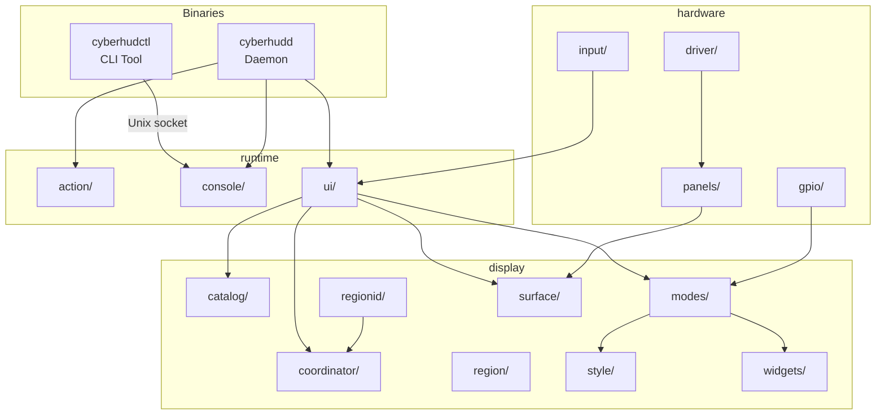
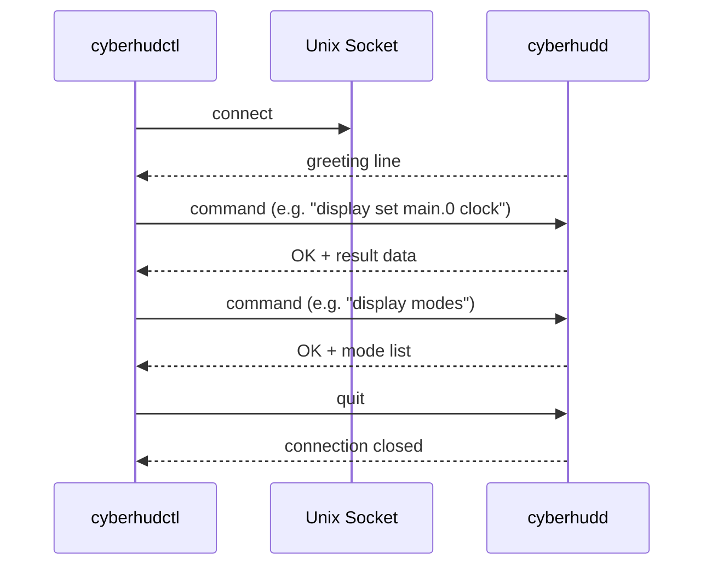
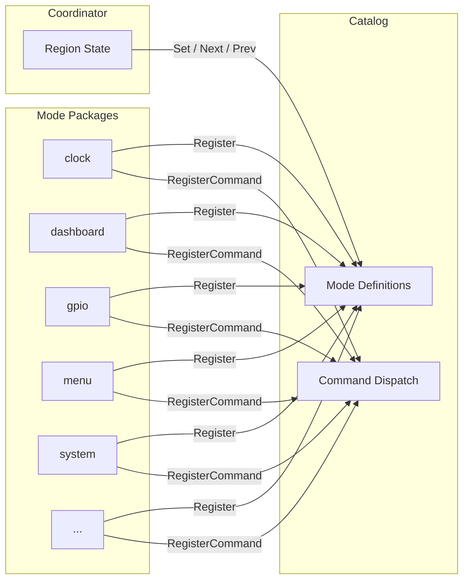
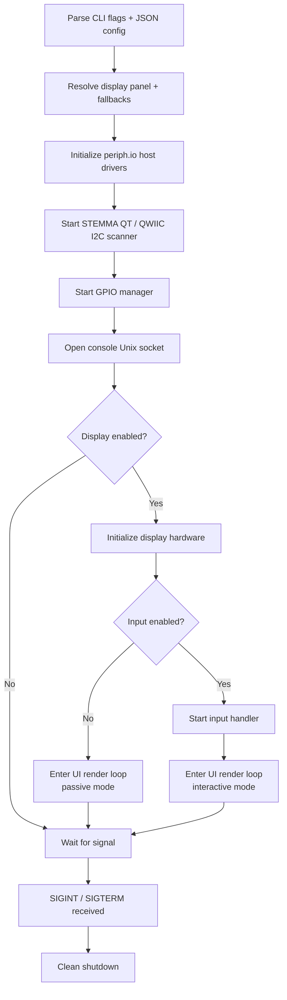

# Architecture

The cyberhud project is a Go-based system for driving small SPI/I2C displays attached to a Raspberry Pi, providing real-time status dashboards, hardware monitoring, and interactive menus on connected panels.

## Component Overview



The system consists of two main binaries and a set of libraries:

```
cmd/
├── cyberhudd/          ← Background daemon (display + hardware management)
└── cyberhudctl/        ← CLI tool (user-facing control interface)

display/
├── catalog/            ← Mode registry + command dispatcher
├── coordinator/        ← Per-region mode state manager (Set, Next, Prev)
├── modes/              ← Display mode implementations (30 packages)
│   ├── attract_bokeh/
│   ├── attract_geometric/
│   ├── attract_matrix/
│   ├── attract_particles/
│   ├── attract_plasma/
│   ├── attract_shapes/
│   ├── attract_starfield/
│   ├── attract_waveform/
│   ├── clock/
│   ├── cycle/
│   ├── dashboard/
│   ├── demo/
│   ├── gpio/
│   ├── gpio_control/
│   ├── image/
│   ├── menu/
│   ├── pager/
│   ├── serial/
│   ├── snapshottest/
│   ├── stemma/
│   ├── system/
│   ├── systemd/
│   ├── testfonts/
│   ├── testicons/
│   ├── testpattern/
│   ├── testwidgets/
│   ├── thermal/
│   ├── ticker/
│   ├── usb/
│   ├── wifi/
│   └── zmq/
├── region/             ← Display region allocation and management
├── regionid/           ← Region ID parsing (<surface>.<index> notation)
├── style/              ← Rendering framework (TextHints, LayoutBridge, StyleContext, ViewData)
├── surface/            ← Framebuffer, rendering surface, font catalog, text layout
└── widgets/            ← Reusable UI widget components

hardware/
├── driver/             ← Display driver abstraction (SPI, I2C interfaces)
├── gpio/               ← GPIO pin manager
├── input/              ← Button and joystick input handler
└── panels/             ← Panel hardware registry and drivers (ST7789, SSD1680, SH1106, etc.)

runtime/
├── action/             ← Action handling framework
├── console/            ← Unix socket console protocol server
└── ui/                 ← UI runtime integration and render loop

tools/
├── docsnap/            ← Documentation snapshot tooling (collect, gallery)
├── fontgen/            ← Font code generation
├── gen-icons/          ← Material icon generation
└── modegen/            ← Mode scaffold generation

util/
└── cfgutil/            ← Configuration utility helpers

ghpages/                ← MkDocs documentation site (GitHub Pages)
website/                ← Astro marketing site (cyberhud.io)
debian/                 ← Debian packaging files
systemd/                ← Systemd service files
examples/               ← Usage examples and sample config files
```

## cyberhudd (Daemon)

The daemon is the long-running process that:

- Initializes hardware (SPI displays, I2C buses, GPIO pins)
- Scans for STEMMA QT / QWIIC devices on I2C buses
- Renders display modes to connected panels via the style system
- Manages per-region mode state through the coordinator
- Listens for commands on a Unix domain socket
- Handles button/joystick input for interactive navigation

On startup, the daemon selects a **panel** matching the attached hardware and configures the available display modes for that panel. It supports fallback panels if the primary one fails to initialize.

## cyberhudctl (CLI Tool)

The CLI tool communicates with the running daemon over its Unix socket. It translates user-friendly commands into the daemon's line-oriented protocol and formats responses for terminal display.

```sh
# Check daemon status
cyberhudctl status

# Switch region main.0 to clock mode
cyberhudctl display set 0 clock

# List available display modes
cyberhudctl display modes

# List configured display regions
cyberhudctl display regions

# Cycle to next mode on region 0
cyberhudctl display next main.0

# Configure policy fields on the active mode
cyberhudctl display config main.0 speed=1.5
```

## Communication Protocol

The daemon and CLI communicate via a Unix domain socket at `/run/cyberhudd/console.sock`. The protocol is line-oriented and text-based:



1. The daemon writes a greeting line on connection
2. The client sends one command per line
3. The daemon responds with `OK` or `ERR` followed by result data
4. The client sends `quit` to close the connection

This design allows any tool that can write to a Unix socket to interact with the daemon, not just `cyberhudctl`.

## Catalog System

The catalog (`display/catalog/`) provides the mode registry and command dispatcher for the entire display system.

### Mode Registry (Register, Describe)

Mode packages call `catalog.Register()` in their `init()` function to publish a `Definition` containing:

- **ID** — the mode's unique lowercase identifier (e.g., `"attract_bokeh"`)
- **Title** — human-readable name
- **Scope** — categorization scope (e.g., `"display mode"`)
- **Summary** — one-sentence description
- **Order** — priority for display listing
- **Options** — configurable policy fields (`OptionDefinition` with Key, Type, Summary, Default, Allowed)

At runtime, the daemon calls `catalog.Describe(mode)` to retrieve metadata for a specific mode, or `catalog.Definitions()` to enumerate all registered modes in priority order.

### Command Dispatcher (RegisterCommand, Command)

Mode packages register mode-specific console commands via `catalog.RegisterCommand()`, providing a `CommandDefinition` with:

- **Verb** — the command verb (e.g., `"attract_bokeh"`)
- **Summary** — one-line description
- **Usage** — usage pattern string
- **Handle** — the `CommandHandler` function that processes arguments

When the console receives a mode-specific command, it calls `catalog.Command(verb)` to look up the handler and dispatches the arguments. This allows each mode to implement its own console sub-commands without coupling the protocol layer to mode internals.

## Coordinator

The coordinator (`display/coordinator/`) tracks per-region display mode state and provides remote-control operations. It depends on the catalog for enriching region metadata with mode definitions.

### Operations

- **Set(index, mode)** — switches the specified region to the named mode. Returns an error if the region is not configured or the mode is not in the region's allowed list.
- **Next(index)** — advances to the next mode in the region's mode list, wrapping from the last mode back to the first.
- **Prev(index)** — moves to the previous mode, wrapping from the first mode to the last.

### Region State

Each region tracks:

- A name and controller identifier
- An ordered list of available modes
- A current mode index (pointer into the modes list)

The coordinator is initialized with `Region` definitions specifying the index, name, controller, available modes, and default mode. It provides `Status()` and `Definitions()` methods for querying region snapshots enriched with catalog metadata.

## Style System

The style system (`display/style/`) is the rendering framework that display modes use to produce visual output. It decouples mode logic from panel-specific rendering concerns through a layered set of types.

### TextHints

`TextHints` (defined in `display/surface/textlayout/`) provides panel pixel and glyph metrics:

- **Pixel dimensions** — `PixelWidth`, `PixelHeight`
- **Glyph metrics** — `GlyphWidth`, `GlyphHeight`, `GlyphAdvance`, `RowHeight`
- **Capability flags** — `Capability` (MonoSlow through ColorFast), scroll support flags, refresh preferences
- **Font catalog** — tier-based font access via `Catalog` field
- **Panel identity** — `PanelProduct`, `ScreenName`, `PPI`

TextHints is screen-level metadata independent of chipset, describing what a panel can render.

### LayoutBridge

`LayoutBridge` (defined in `display/style/layout/`) provides content positioning calculations from TextHints and padding configuration:

- Content origin and available dimensions
- Row positioning (`RowY`, `RowX`, `RowBottomY`)
- Text measurement (`TextPixelWidth`, `CenterX`)
- Vertical layout (`MaxVisibleRows`, `CenterBlockY`, `FitRows`, `BottomAnchorY`)
- Inline widget bounds

Styles construct a LayoutBridge via `NewLayoutBridge(hints, cfg)` with their own `BridgeConfig` specifying padding, title bar, and status bar preferences.

### StyleContext

`StyleContext` is the per-render context passed to a Style's `Build` method. It combines:

- A pre-built `LayoutBridge` for spatial queries
- The raw `TextHints` for styles that need custom layout
- A font `Catalog` for tier-based font lookups
- `Capability` flags for hardware-aware rendering decisions

### ViewData

`ViewData` is the rendering output produced by a Style's `Build` method. It carries:

- **Title** — display title string
- **Items** — rendered text lines
- **Colors** — per-item color values
- **Hint** — status hint text
- **Tiers** — per-row font tier intent
- **FontID/FontIDs** — resolved font identifiers
- **LineOffsets** — per-line horizontal pixel offset (marquee)
- **OffsetY** — vertical pixel offset for centering
- **Cursor/TopRow** — scroll state
- **Static** — whether the view requires no animation ticks
- **Sprites** — positioned widget sprites
- **StyleReport** — metadata about which style was resolved

## Display Modes



Display modes are self-contained packages under `display/modes/`. Each mode:

- Implements the mode interface (ID, action handler, item count, view builder, data signature)
- Registers itself in the **catalog** via `catalog.Register()` with metadata
- Optionally registers mode-specific console commands via `catalog.RegisterCommand()`

The catalog pattern allows the daemon to look up modes by ID at runtime without hardcoding dependencies between the UI loop and individual mode packages.

See [Display Modes](../display-modes/index.md) for a full list of available modes.

## Panel Drivers

Panel drivers live under `hardware/panels/` with each hardware product in its own sub-package. A panel driver:

- Calls `panels.Register(...)` in its `init()` function to self-register
- Defines display dimensions, controller type, SPI configuration, and GPIO pin assignments
- Specifies which input pins (buttons, joystick) are available on the hardware

The `hardware/panels/all` package imports every built-in panel driver so the daemon picks them up automatically at startup.

Supported panel controllers include:

| Controller | Example Hardware |
|-----------|-----------------|
| ST7789 | Waveshare 1.3" LCD HAT, Waveshare 2.2" SPI |
| ST7735S | Waveshare 1.44" LCD HAT |
| SH1106 | Waveshare 1.3" OLED HAT |
| SSD1680 | Adafruit 2.13" e-ink bonnet |
| IS31FL3731 | Adafruit 15×7 CharliePlex LED |

## Startup Flow



1. Parse CLI flags and optional JSON config file
2. Resolve the display panel (primary + fallbacks)
3. Initialize periph.io host drivers
4. Start the STEMMA QT / QWIIC I2C scanner
5. Start the GPIO manager
6. Open the console Unix socket
7. Initialize the display hardware and input handler
8. Enter the UI render loop

The daemon runs until it receives `SIGINT` or `SIGTERM`, then performs a clean shutdown of all subsystems.
